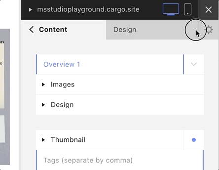
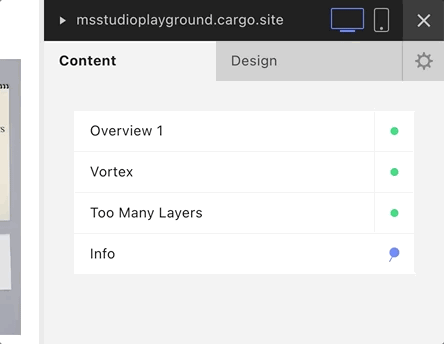

Quelques conseils d'utilisation pour la plateforme Cargo.

## Liens importants

- Infos sur le [Student Program](https://cargo.site/Students) (offre gratuite pour étudiants)
- Support technique: [https://support.cargo.site/](https://support.cargo.site/)

## Tutoriels

### Publier un site Cargo

Vous pouvez créer gratuitement créer un compte Cargo, et mette en place votre site en privé. Une fois que vous souhaitez rendre le site public (le publier), vous devrez soit contracter un abonnement payant, soit saisir un code de réduction.

**Méthode pour entrer le code:**

### Partager l’accès à un site Cargo avec plusieurs utilisateurs:

C’est possible, voir: 
[https://support.cargo.site/Managing-multiple-Sites](https://support.cargo.site/Managing-multiple-Sites)

> You can give someone else access to a Cargo site under your account by making them an Editor. Click on the “Editors” link in the Site Manager and send them an “Editor invite.” This will send the recipient an email with instructions on how to add the Cargo site to their account. If they’re not yet a Cargo member, they will be prompted to create a username and password to gain access to the Cargo site. Adding an Editor grants them full access privileges to the site.

**Méthode pour inviter des collaborateurs:**

### Utiliser son nom de domaine

Pour utiliser son propre nom de domaine, il faut effectuer un changement DNS qui est décrit ici: [Using a Third Party Domain](https://support.cargo.site/Using-a-Third-Party-Domain)

Il existe une interface de modification DNS dans Cargo, elle est expliquée sous [Cargo Domain DNS Editing](https://support.cargo.site/Cargo-Domain-DNS-Editing)
