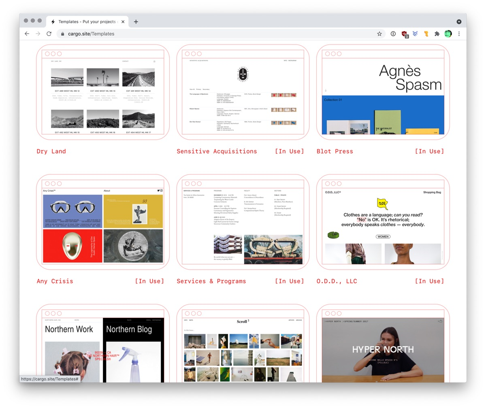
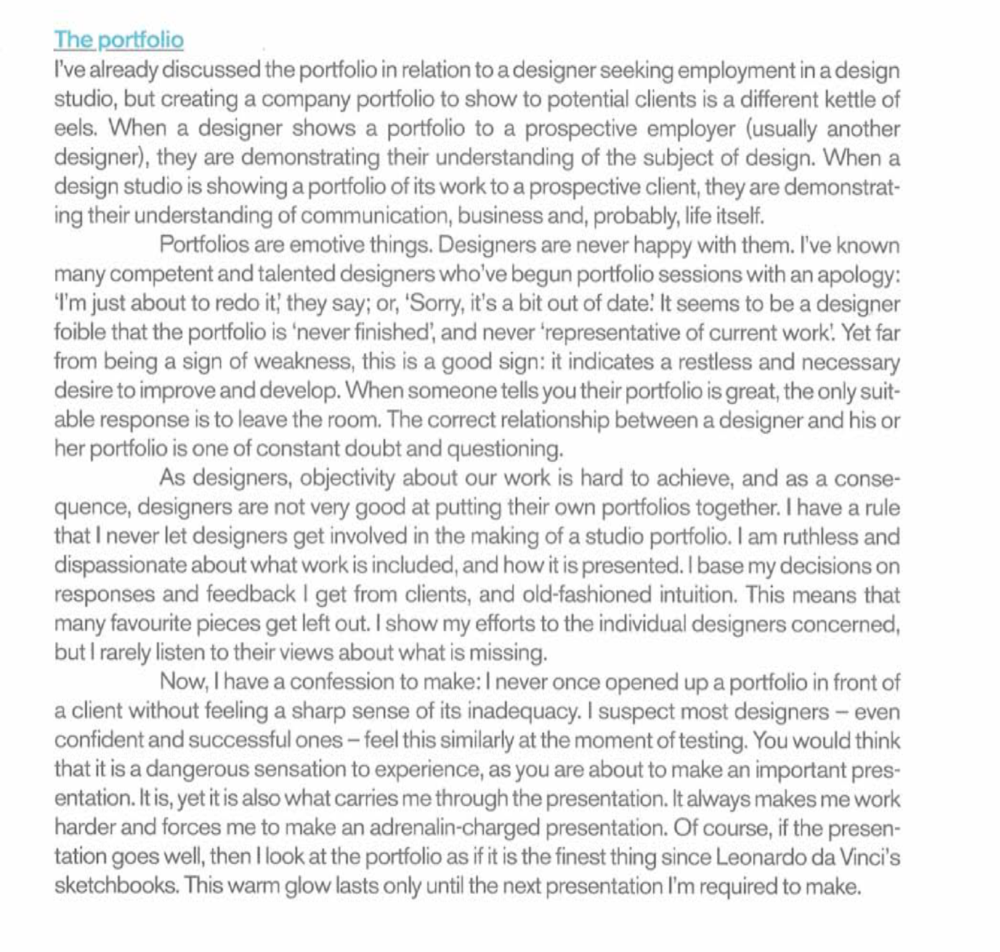
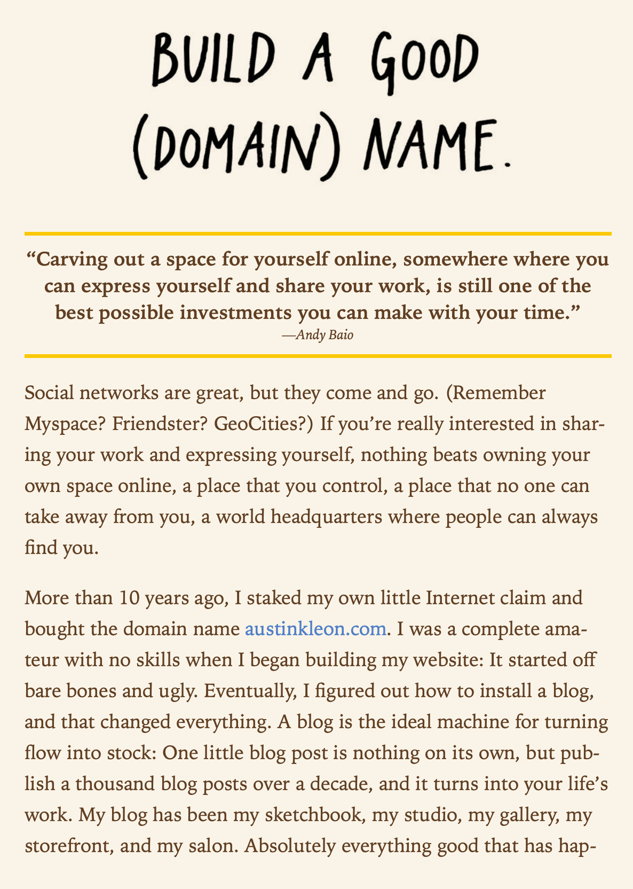
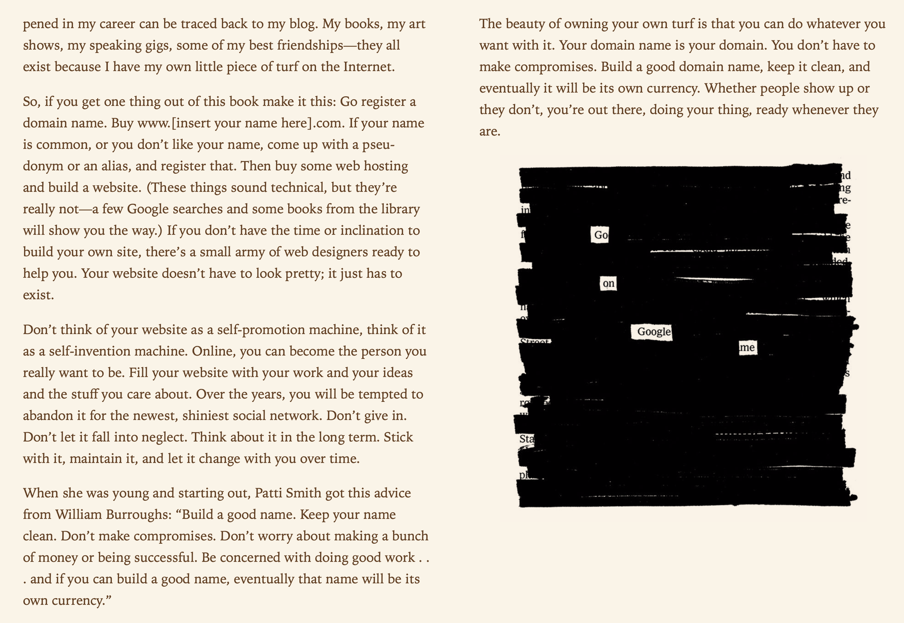

## Recommandations

Méthodes possibles pour créer son portfolio:

- site Cargo - [https://cargo.site/Students](https://cargo.site/Students)
- template Netlify
- codé 100% main ✌️
- WordPress ou autre CMS

## Ressources nom de domaine

Infos concernant les noms de domaine:

- [Cours Web: Noms de domaine](https://cours-web.ch/divers/domaines.html).
- Une [liste d'extensions](https://docs.google.com/spreadsheets/d/1orzB_c24-kh9nZUnYcOhmcXi8IcHGHipT5l6WAwKfLM/edit?usp=sharing) et de leur prix (tarifs Infomaniak).

## Ressources Cargo

Infos concernant Cargo:
- Guide d'utilisation: [https://support.cargo.site/](https://support.cargo.site/)
- Cargo est [gratuit pour les étudiants](https://cargo.site/Students). Le code à utiliser pour publier votre site sera transmis par votre enseignant-e.

Exemples de sites portfolio:

- *[10 amazing portfolios from Carnegie Mellon students](https://wf-blog-2021.webflow.io/blog/student-portfolio-examples)*, Webflow Blog.

## Citations

Sur le rôle du portfolio, observations d'Adrian Shaughnessy dans son livre "How to Be a Graphic Designer Without Losing Your Soul" (2005)

Sur le rôle d'un site internet personnel, observations d'Austin Kleon, dans son livre "Show Your Work!" (*Montrez votre travail*):

## Lectures

- *[6 étapes pour foirer le design de son portfolio](https://web.archive.org/web/20221202084931/https://www.magazineduwebdesign.com/conseils/guides/6-etapes-pour-foirer-le-design-de-son-portfolio/)*
- Benoît Drouillat, *[L’art (difficile) de composer un portfolio](https://medium.com/designers-interactifs/lart-difficile-de-composer-un-portfolio-5004c1031072)*, 2018.

### In english

- Readymag, *[How to make an online portfolio: 6 basic rules + 5 bonus tips](https://journal.readymag.com/how-to-make-an-online-portfolio-6-basic-rules-5-bonus-tips-a2a538dee3ad)*
- Fabricio Teixeira, *[Things I (honestly) don’t want to see in your portfolio](https://uxdesign.cc/things-i-honestly-dont-want-to-see-in-your-portfolio-3d3497666ca8)*
- Mitch Goldstein, *[what is something that you wish you did differently when you were a design student?](https://twitter.com/mgoldst/status/1011675889115938817)*, via [Creative Bloq](https://www.creativebloq.com/advice/former-design-students-pass-on-advice-for-newcomers).
- Tobias van Schneider, *[10 inspiring UX portfolios and why they work](https://vanschneider.com/blog/portfolio-tips/10-inspiring-ux-portfolios-work/)*, 2018.
- Tobias van Schneider, *[Your portfolio is not the work you did, but the work you're going to do next](https://medium.com/semplice-labs/there-is-one-thing-we-at-semplice-like-to-repeat-again-and-again-when-it-comes-to-building-a-great-84f585cf1afa)*, 2015.
- Tobias van Schneider, *[The most underrated page on your portfolio](https://vanschneider.medium.com/the-most-underrated-page-on-your-online-portfolio-76df58c9c023)*, 2020.

